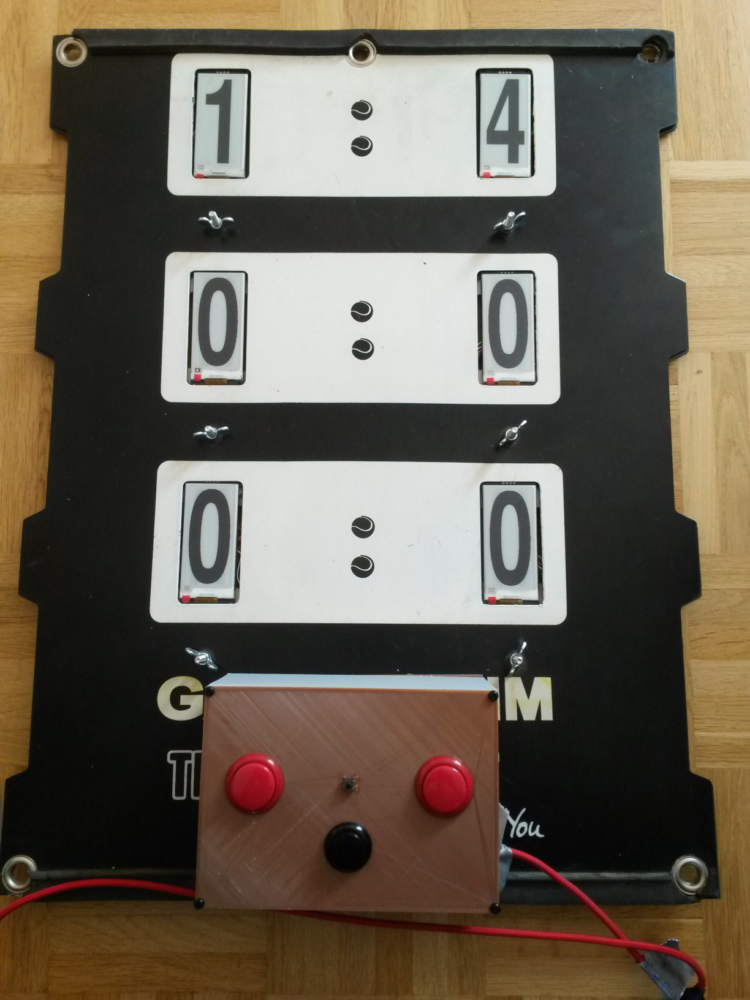

# electronic tennis scoreboard with mqtt interface



## hardware
- an existing analog scoreboard like in the picture
- 6 WeAct Studio Epaper Module 2,9 '' <https://github.com/WeActStudio/WeActStudio.EpaperModule>
- esp32 nodencu board <https://www.berrybase.de/esp32-nodemcu-development-board>
- arcade buttons

## wiring
### Epaper modules
Each Epaper module has got 8 wires. According to GxEPD2 library 6 of them can be shared. Only the CS,Busy wires have be treated individually.

| EPaper wire    | GPIO  pin |
| :-------- | :------- |
|  VCC  | 3.3 V    |
| GND | GND |
| SDA    | 23 |
| SCL  | 18 |
| CS | individual |
| D/C | 17 |
| Reset  | 16 |
| Busy   | individual |

The individual GPIO pins can be read from the arduino code.

### buttons

| button    | GPIO  pin |
| :-------- | :------- |
| set games for home in set  | 34  |
| set games for guest in set | 35 |
| change set    | 32 |
| reset board  | 33 |

caveat: as the GPIO pins 34,35 don't have an internal pullup resistor, you need to connect manually a pullup resistor (10k ohm) to 3.3V. 

## howto use
### manual use
After powering up the board sets every score to 0 (like in reset) in a FullWindow mode -> GxEPD2 library. The Epaper module is blinking. By default the focus is set to set1. You can use the 2 
buttons to set the games in the set by counting up the games. To change the focus of the set you use the change set button. The number of games for home in the following set is being re-displayed in FullWindow mode, so it is blinking. This indicates that the set has been changed successfully. The reset button resets the board like in powering up.
### use with mqtt
The boards connects to mqtt broker to a main topic
 
 - it subscribes to the <main topic>/toCourt1
 - it publishes to the <main topic>/fromCourt1
 
The data format is json, examples (mosquitto client):

- toCourt1:
```
mosquitto_pub -t Tennisscoreboard/toCourt1 -m "{ Score: { \"HeimSet1\": "5", \"GastSet1\": "4", \"HeimSet2\": "0", \"GastSet2\": "0", \"HeimSet3\": "0", \"GastSet3\": "0" }}"
mosquitto_pub -t Tennisscoreboard/toCourt1 -m "{ reset: \"true\" }"
```

- fromCourt1:
```
mosquitto_sub -t Tennisscoreboard/fromCourt1 
{"HeimSet1":6,"GastSet1":4,"HeimSet2":0,"GastSet2":0,"HeimSet3":0,"GastSet3":0}
```
